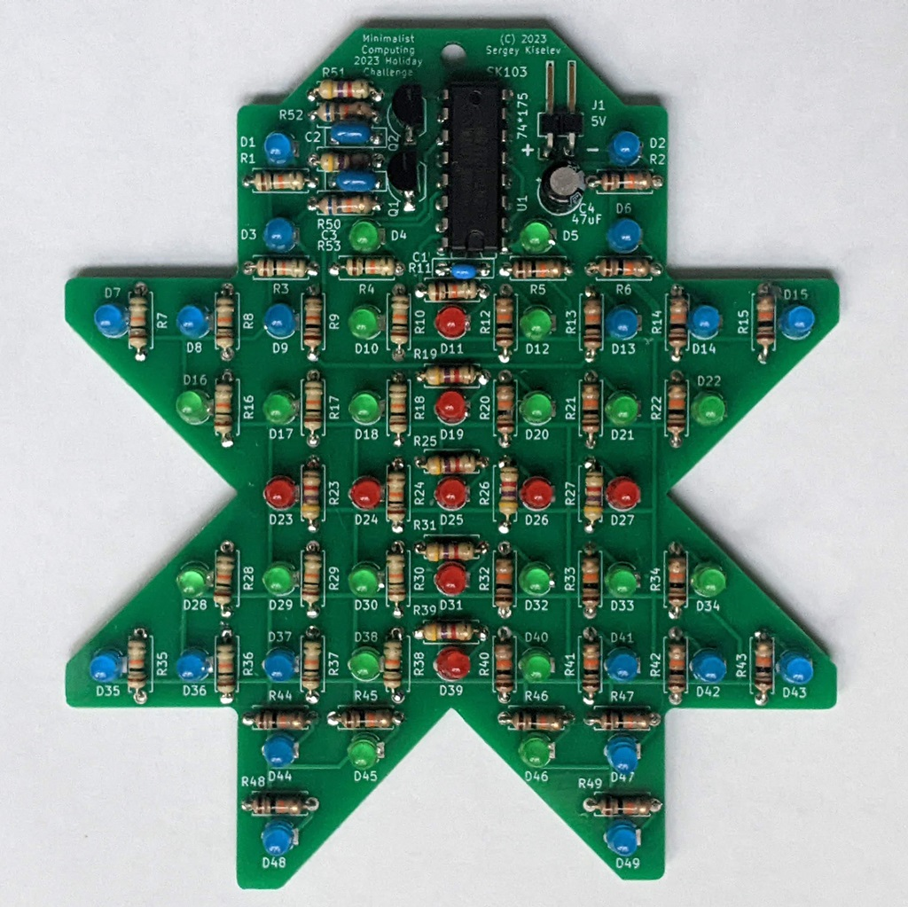

# Minimalist Computing - Holiday Design Contest

This project is my submission for the Facebook's Minimalist Computing group Holiday Design Contest.

## Design Contest Rules
* Holiday related design
* Can use one 7400-series IC. The logic family does not matter. It can be HC, LS, etc.
* Can use 2 transistors maximum
* Any number of passive components: capacitors, resistors, diodes, coils, LEDs (without any ICs in the LED packages, e.g. self-flashing or color changing LEDs)
* The only external connection is the power supply

## My Design's Description

My design is a eight pointed star with animated LEDs. The shape is inspired by the [Vintage Computing Christmas Challenge 2022](https://logiker.com/Vintage-Computing-Christmas-Challenge-2022) challenge.

The [design](KiCad/star-schematic-1.0.pdf) includes:
* A multivibrator, implemented using two transistors - Q1 and Q2, four resistors - R50-R53, and two capacitors - C2 and C3. The multivibrator provides the clock for the circuit.
* The choosen values of the R52, R53 - 62 k, C2 and C3 - 2.2 uF result in approximately 5.3 Hz frequency. The formula to calculate the frequency is f = 1 / (ln(2)(R52\*C2+R53\*C3)), or since R52 = R53 and C2 = C3, it can be simplifed to f ~= 0.72/(R52*C2).
* A 4 bit Johnson counter, implemented using a 74*175 - four D-type flip-flops IC. In my own build I used the [74LS175](https://www.ti.com/lit/ds/symlink/sn74ls174.pdf) IC, but I think any other series will work just as well.
* 3 outputs of the counter are connected to the LEDs through a current limiting resistors. The last output is not connected to the LEDs. This creates a two tick delay when all LEDs are on and all LEDs are off.
* The LEDs are connected between the inverted outputs of the flip-flops and VCC.
* This is because TTL/TTL-LS series ICs have their low-level output current IOL much higher than their high-level output current IOH. For the 74LS175 the values are 16 mA and -800 uA respectively.
* The current limiting resistors have a fairly large resistance. I used 4.7 k for red LEDs and 10k for green and blue LEDs. This keeps the current well within the IC's IOL specifications.

## Design Files

* [Schematic](KiCad/star-schematic-1.0.pdf)
* [PCB Layout](KiCad/star-board-1.0.pdf)

## Licensing

The hardware design, including schematic and PCB layout design files are licensed under the strongly-reciprocal variant of [CERN Open Hardware Licence version 2](license-cern_ohl_s_v2.txt).

